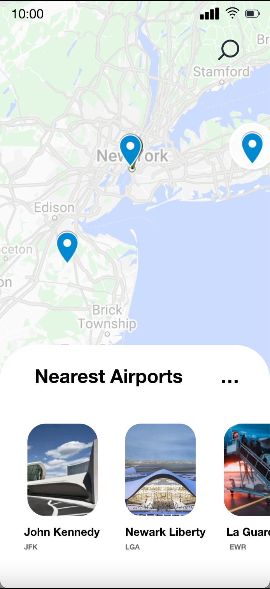

# THOMAS_CLOSE_2285-10_SCREENS

Ce repo est un dossier pour l'examen de Design D'Application Mobiles.

## Screen 1

<table>
    <thead>
        <tr>
            <th>Original </th>
            <th align="center"> Reproduction</th>
        </tr>
    </thead>
    <tbody>
        <tr>
            <td>  </td>
            <td align="center"></td>
        </tr>
    </tbody>
</table>

## Screen 2

## Screen 3

## Screen 4

## Screen 5

## Screen 6

## Screen 7

## Screen 8

## Screen 9

## Screen 10